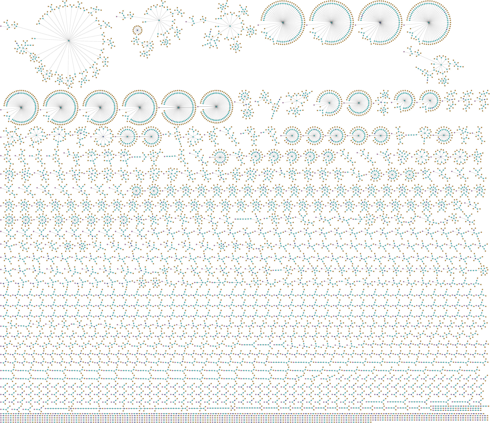
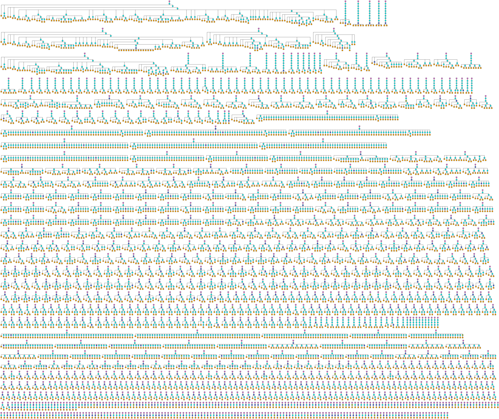

# cormel2neo: Loading avro-format transaction trees into neo4j and hence into other tools

## Introduction

ESI data is processed by `CorMel` into *transaction trees* with the following
structure:

* CorMel defines 5 "segments" in all: A, E, H, T and U, which store data
pertaining to transaction trees.
* The common features (across all entities of the transaction tree) are stored
in a `U` segment for each transaction tree, which acts as the root of the tree.
* The `U` node is connected to a single `T` node, which is the transaction that
spawns the other transactions in the tree.
* Each transaction `T` node can have 0 or more child transactions (`T` nodes).
* The leaf nodes can be `T` nodes, or alternatively hop (`H`) nodes, `A` or `E`
nodes.
* The `A` and `E` nodes often have blank properties and/or default data, and
so are loaded into neo4j but are not used for further analysis. They appear to
be descriptive and are shared between transaction trees.

Each CorMel segment is associated with a standard list of fields, hence it is
equivalent to a table in a relational database, or a node in a property graph.

Although transaction trees have a natural mapping into graph data structures,
this aspect of their nature has not been explored in Amadeus. The research
hypothesis is that transaction trees can be classified into two categories,
depending on whether they are associated with *successful* or *unsuccessful*
outcomes.

Note that *success* and *failure* have specific meanings in this context. For
example, a customer could decide to abandon a search, or even a booking, before
completing all steps. Because the customer made the decision, Amadeus
infrastructure was not at fault, and the incomplete transaction tree does not
represent a problem for the Amadeus devops team to fix[^1]. Another scenario
would be that a network link failure occurred, in which case the service
response never arrived, so the customer had no choice and was unable to proceed
with the transaction. As seen by the customer, the system became unresponsive,
or even provided an error message of the form "The system is currently
unavailable.  Please try again later." Neither of these represents a
*successful* outcome. Even worse, such problems are likely to recur, and to
affect other customers. Hence they need to be addressed as soon as possible.

[^1]: Perhaps the Customer Experience team might be interested in analysing
transactions abandoned by customers, as there might be ways of improving the
customer experience with the intention of increasing the completion rate of
transactions. However, such offline analysis is outside the scope of the
present study.
 
The research hypothesis is that there are *structural* and/or *property*
differences between successful and unsuccessful transaction trees. Furthermore,
it might even be possible to suggest some queries that could be used to derive
the root cause of *correlated* problems.

One possible structural difference might include highly unbalanced trees,
reflecting the fact that, if a particular edge in the tree failed, the
redundancy built into the Amadeus services infrastructure is such that other
parts of the transaction might succeed (and generate lots of activity in the
logs, hence segments in the CorMel transaction tree) although the overall
transaction might fail.

Property differences could be subtle and might be more useful for root cause
determination. For example, the transaction might invoke a service that was
recently updated, or be directed to an endpoint that is struggling to meet
demand. Such property data is stored in the segment records. (Graph) database
queries might help to find common property settings across problematic
transaction trees.

## The processing pipeline

### CorMel format to Avro

The CorMel system takes data from the logs and generates the transaction trees.
This data is then serialised in [Avro](https://avro.apache.org/) format and
stored efficiently in (binary) data files. A single example file was provided
for development purposes and placed in the `cormel2neo/input` directory. In Avro
format it occupies 13.9MB and contains 24,499 transaction tree records, as
counted by the [avrocount](https://github.com/jwoschitz/avrocount) command-line
tool:

    java -jar ~/tools/avro/avrocount-0.3.0.jar\
      input/par_U170504_010000_S170504_005800_D60_lgcaa101_20205_0000.gz.avro\
      2> /dev/null

### CorMel Avro format to CorMel JSON format

The Avro format, being binary, is not suitable for inspecting the data.
However, it can be converted easily to JSON format. First, we use the
[avro-tools](https://avro.apache.org/) tool to derive the CorMel Avro schema
`cormel.avsc`:

    java -jar ~/tools/avro/avro-tools-1.8.2.jar getschema\
      input/par_U170504_010000_S170504_005800_D60_lgcaa101_20205_0000.gz.avro\
      > cormel.avsc
 
We can now use [avro-tools](https://avro.apache.org/) to generate the JSON format,
using the `--pretty` option, otherwise the generated JSON lines are extremely long
and hard to read:

    java -jar ~/tools/avro/avro-tools-1.8.2.jar tojson --pretty\
      input/par_U170504_010000_S170504_005800_D60_lgcaa101_20205_0000.gz.avro\
      > input/converted.json

Alternatively, `jq` can be used with its default operation being to pretty
print with 2 spaces used for indentation:

    jq . < (input).json > (input)pp.json

For reference, the resulting `input/converted.json` occupies 395.2MB and has
14,470,577 lines of text.

Once the data is in CorMel Avro format, it is possible to investigate it and
generate subsets.

One investigation concerned whether the `DcxID` field in each `Usegment` is
sufficient to identify transaction trees uniquely. The following command
generated a count of DcxId:

    grep '^  "DcxId" :' input/converted.json | sort | uniq | wc -l

which had fewer unique values (19,815) than there were transaction trees
(24,499).  Further inspection indicated that the combination of `DcxId` and
`TreeId` appears to be unique to each transaction tree.

This analysis proved to be useful during development when it was found that
some records were not being uploaded to neo4j. By identifying an example `DcxId
= "08044X4RIR6H1CW6S739ZB#T91"` that was associated with 3 transaction trees,
it was possible to check that the revised version was loading all the
transactions, as required. First, we used [jq](https://stedolan.github.io/jq/)
to extract the 3 transaction tree records into a smaller CorMel JSON file,
`input/filtered.json`:

    jq '. | select(.DcxId | contains("08044X4RIR6H1CW6S739ZB#T91"))?' <\
      input/converted.json > input/filtered.json

The [avro-tools](https://avro.apache.org/) tool was then used to convert
`input/filtered.json` file back to Avro format as `input/filtered.avro`, for a
test upload to neo4j.

    java -jar ~/tools/avro/avro-tools-1.8.2.jar fromjson --schema-file\
      cormel.avsc input/filtered.json > input/filtered.avro

In general, however, it is more convenient to work with the (space-efficient)
Avro format directly, especially since [avro-tools](https://avro.apache.org/)
provides bindings for common languages (such as Java and python) to perform
operations (notably serialising and deserialising) to/from Avro data.

### CorMel Avro format to neo4j

[Neo4j](https://neo4j.com/) claims to be the world's leading graph database
platform. It is relatively mature and so offers many tools, particularly in its
[APOC](https://guides.neo4j.com/apoc) extension suite, for graph data analysis
and other advanced operations. Thus it was the obvious graph platform choice.

#### Parsing and mapping from Avro to Neo4j

To upload the data into Neo4j, it is necessary to parse the CorMel data
hierarchy for each transaction tree, and to map each entity into a Neo4j node,
with the edges in the transaction tree being mapped to Neo4j relationships. The
data fields in each CorMel segment are mapped to properties in the associated
Neo4j node.  The node types (`A`, `E`, `H`, `T` and `U`) become Neo4j node
*labels*, and are also added as an extra node property for convenience when
creating queries.

#### Uniqueness constraints
As with any database, it is necessary to define constraints so that duplicate
nodes and relationships are not generated when parsing the transaction trees. For the
legacy indexes in Neo4j 1.x, it was the developer's responsibility to write the
business logic to enforce the constraints to prevent entity duplication.  Since
Neo4j version 2.0, database-level index operations have become available and
much of this logic can be defined declaratively, at the database level, as
would be common in RDBMS. For Neo4j Enterprise customers, uniqueness
constraints can be defined in terms of a combination of property fields, but
each constraint in Neo4j Community Edition is limited to a single property field. In
RDBMS terms, the distinction is between *simple* and *compound* indexes. As a
workaround, we derived a key based on a concatenation of the relevant properties in each
node, stored it in the node as an additional property, and defined the
uniqueness constraint in terms of this derived key.

This workaround achieves the objective of guaranteeing uniqueness, but at the
cost of increasing the space requirement for each node.

#### Architecture and performance

Initially, Neo4j was deployed as a service running in a docker container on the
development laptop. This worked well, until we needed to deploy the latest
version of APOC, and could not find a suitable container definition. We then
switched to a local (in the sense of being installed into `~/tools`)
installation of the Neo4j service.

The upload application is written in Java and interacts with the Neo4j server
by issuing parametrised cypher commands via the the Java database driver over
Neo4j's `Bolt` binary protocol. Generally, the parameters define the node
properties (key-value pairs) containing the data that needs to be uploaded from
the CorMel segments comprising the transaction tree. 

The CorMel upload runs in its own JVM, outside the JVM used by Neo4j, but
sharing resources such as the laptop's CPU, memory and disk. Therefore
efficient use of these resources is a priority.

Initial upload runs had poor performance. Switching to a more powerful laptop
(with a Xeon server-class processor and 64GB of memory) brought little
improvement.  By instrumenting the code, we discovered that performance dropped
as more data was uploaded: transaction tree load times started at about 14
seconds and steadily increased as more transaction trees were added to the
database. Thus a full load (of approximately 25K transaction trees) would take
days to complete.  CPU activity was very high so the laptop fan needed to work
hard to keep the laptop cool. Thus we stopped the uploads as soon as it became
apparent they were making slow progress.

Further analysis indicated that initial versions of the upload application did
not rebuild the Neo4j indexes after refreshing the database and so were unable
to benefit from these indexes when enforcing the constraints, resulting in the
graph database equivalent of "full table scans".  When this problem was fixed,
the overall run time dropped to less than 7 minutes for the full set of
transaction trees.

Resource usage remained quite high, so more flexible transaction handling was
introduced.  Initial versions opened up a single session for each file upload,
which had the effect of beginning a transaction which was closed when the
session closed after all the CorMel data in that file had been processed.
However, Neo4j allows developers to create transactions explicitly. It is even
possible, though discouraged in the documentation, to insert
`beginTransaction()` and corresponding `success()` (commit) and `close()`
method calls in the code. This fine degree of transaction control was added,
shaving about 20 seconds off the overall run time, and reducing the resource
usage (as seen from the output of the `top` command).

Timing data for each run can be found in `output/timings/yyyymmdd_HHMMSS.txt`,
where `yyyymmdd_HHMMSS` represents a typical timestamp for when the run
started. Timing data can be plotted using the `octave` function
`script/plotTimings.m` as follows:

    echo "cd script; plotTimings(\"../output/timings/20170802_153002.txt\")"\
      | octave -qf 2> /dev/null

where the resulting plot can be found in `output/timings/20170802_153002.pdf`
which can be viewed in Figure 1 below. For convenience, the PDF can be cropped
as follows:

    pdfcrop --margins 5 output/timings/20170802_153002.pdf\
      graphics/20170802_153002-CROPPED.pdf

and converted to PNG (for insertion into MS documents on MS Windows; PDF gives better results
(because it is a vector format) in both LaTeX and LibreOffice documents and MS documents on MacOS) using 

    pdftoppm -f 1 -singlefile -png graphics/20170802_153002-CROPPED.pdf\
      graphics/20170802_153002-CROPPED

The resulting plot can be viewed in Figure 1 below.

{height=9cm}

For convenience, it is possible to recreate this and other PNG files using

    script/pdf2png.sh 1024

where `1024` in this example represents the desired resolution, in pixels, of
the longest side of the image. Note that `script/pdf2png.sh` is designed not to
overwrite existing PNG files in the set it generates.

#### The upload application

The upload application has many transitive dependencies and so was built using
maven.  It is run as a command line application with two arguments: the
location of the Avro input file, and a string (which defaults to `partial`)
indicating whether this is a full (all records) or partial (just a subset of
the records) upload.  If it is a partial load,

* the time taken to load each transaction tree is reported on `stdout` and sent to a timings file.
* there is just one `transaction` per `session`

For a `full` upload, progress reporting frequency is reduced (once every 500
transaction tree uploads, say) and there are multiple `transaction`s per
`session` (a transaction is committed, closed and a new one opened after 2500
transactions trees have been uploaded, say).
  
Upload runs have the following form:

    script/uploadCormelAvroToNeo4j.sh\
      input/par_U170504_010000_S170504_005800_D60_lgcaa101_20205_0000.gz.avro\
      full

or

    script/uploadCormelAvroToNeo4j.sh input/sample.avro partial

This bash script stops the Neo4j database if it is running, resets the database
and restarts it before invoking the Java application with the appropriate
arguments. The Java application does the work.

#### Analysis options in Neo4j

Neo4j, via its APOC extension package, offers the following graph analysis algorithms:

* Closeness centrality: `apoc.algo.closeness(...)`
* Betweenness Centrality: `apoc.algo.betweenness(...)`
* PageRank: `apoc.algo.pageRankWithConfig(...)` and `apoc.algo.pageRank(...)`

Because of the structure of the graph, the results are not particularly interesting.
However, if the transaction trees were classified into "successful" and "failed"
categories, it might be possible to use such per-node scores to suggest interesting
discriminating features.

#### Visualisation and analysis options

Neo4j provides a basic visualisation using a force-directed layout. While this is
adequate for development and testing purposes, it is difficult to see the
underlying "forest of trees" structure of the graph.

[yEd](https://www.yworks.com/products/yed) and [Gephi](https://gephi.org) are
attractive tools for visualising graphs. The former is more of a business
diagram drawing tool with particularly good support for graph-based diagrams.
The latter is intended more for visualising graphs in their own right; it also
has extensive graph metric calculations.

There are potentially ways to stream Neo4j data to Gephi for plotting, but no
equivalent support is offered for yEd. Therefore, the approach that offers the
most flexibility is to serialise Neo4j data to a common format. In that regard,
graphml is the most attractive format, as

1. It can be uploaded into both yEd and Gephi
2. An APOC procedure exists to export Neo4j data in graphml format.

The main downside is that graphml is a verbose XML-based format and hence
results in relatively large files.

#### Exporting Node4j data to graphml

The following command can be used to export the Neo4j database in graphml
format:

    script/exportNeo4jToGraphml.sh script/exportNeo4jToGraphml.cql\
      script/full.cql output/graphml/full.graphml

The problem with this procedure is that it does not scale well with the size of
the database and has never run to completion in any test so far. However, in
that regard, it would be impossible to interpret a visualisation of 24,499
transaction trees, so it makes sense to derive a random sample of such
transaction trees, and to export this to graphml instead.

[This stackexchange question](https://stackoverflow.com/a/45469605/1988855)
indicates two ways to extract a random subforest of the full forest. Neo4j JVM
memory management problems arose with both, even with the JVM memory limit
setting in `neo4j.conf` increased to 4GB (from 512MB). A common error message
was `GC limit exceeded` where `GC` is the JVM's Garbage Control process. Even
when just the queries run, without attempting to serialise the query results to
graphml, the problem persists. Therefore, an alternative approach was needed.

There is a tool ([`ratatool`](https://github.com/spotify/ratatool)) that
extracts a sample of records from Avro files. A bash script was written to
provide a more convenient interface. An example invocation of this bash script
is:

    script/randomSampleFromAvro.sh -i\
      input/par_U170504_010000_S170504_005800_D60_lgcaa101_20205_0000.gz.avro\
      -o input/sample20.avro -n 20

This sample data can be uploaded, replacing any existing CorMel data in the
Neo4j database, using

    script/uploadCormelAvroToNeo4j.sh input/sample20.avro partial

This data can then be exported as graphml using either

    script/exportNeo4jToGraphml.sh script/exportNeo4jToGraphml.cql\
      script/full.cql output/graphml/sample20.graphml

or

    script/exportNeo4jToGraphml.sh script/exportNeo4jToGraphml.cql\
      script/fullAPOC.cql output/graphml/sample20.graphml

#### Importing the graphml export file into Gephi and yEd

Both yEd and Gephi import the exported graphml files without complaint.
However, there is some data loss. This is because the APOC graphml export
function does not not "register" graphml `<key ..>` elements for each of the
Neo4j node properties stored in graphml `<data ..>` elements. Consequently
these `<data ..>` elements are dropped silently on import. The properties and
their values provide vital context for each node, notably their Neo4j label
(equivalently, their CorMel segment type) among others, so it is necessary to
ensure that this data is protected from deletion on upload.

A python script was written to add the missing elements, and also to add data
that is interpreted by the importing application (yEd or Gephi) to display the
node in colour. This type of additional data is application-specific (different
XML attributes are used for the Neo4j properties in each `<key..>` definition
format, and node colours are specified differently also), so two
variants of extended graphml are needed (one for Gephi, one for yEd).

    script/neo4jGraphmlToOtherGraphml.py output/graphml/sample20.graphml\
      output/graphml/sample20gephi.graphml gephi

and

    script/neo4jGraphmlToOtherGraphml.py output/graphml/sample20.graphml\
      output/graphml/sample20yed.graphml yed

The files relevant to each application can be uploaded without data loss, and
the nodes will be coloured according to their CorMel segment (equivalently,
Neo4j label).

#### Displaying the transaction trees in Gephi and yEd

Several different layouts can be used to display transaction trees in both
Gephi and yEd. Gephi offers a larger choice of options, but in practice, the
`graphviz/dot` layout offers the best way to visualise the transaction trees.

yEd offers fewer layout choices, but arguably more of them are suited to
transaction tree visualisation. In particular, two sets of layouts are most
helpful:

* `hierarchical`
* `series-parallel`

and

* `circular`
* `tree-balloon`

The first two are similar to Gephi's `graphviz/dot` layout, and represent trees
in the traditional fashion, which works well for relatively narrow, deep trees.
The second two work better for broad, shallow trees. In the samples we have
seen, transaction trees can take either "shape".

Even with a sample of just 20 transaction trees, it can be difficult to
interpret the graph visualisations. This is because some transaction nodes are
*degenerate* in the sense that relatively few fields have values assigned to
them. When such transaction nodes are shared between separate transaction
trees, this adds complexity to the graph because the corresponding transaction
trees overlap each other.

Thus there is a visualisation dilemma: visualise single trees (thereby losing
some information and hiding some of the complexity), or visualise the sample of
trees (keeping all the information but making interpretation more difficult).
The latter is more realistic but the resulting "tangle" of transaction trees
looks like overgrown woodland rather than a forestry plantation.

The solution was to show transaction trees in context, but to highlight the
edges belonging to a specified tree. The transaction tree we wish to highlight
is displayed with black edges but the edges of other trees are light grey.

To achieve this type of labeling, it was necessary to enhance the neo4j data
model as it applies to the relationships in the graph. In particular, it was
necessary determine a (combination) of identifiers that is unique per
transaction tree. Since each tree is *rooted* in a single `U` node, it makes
sense to label the tree according to an identifier based on the fields (Neo4j
properties) in its root `U` node.  While the concatenation of all field values
in that node serves as a possible tree identifier, it is long and cumbersome to
use. A *sufficient subset* comprises the `DcxId` and `TreeId` fields. These
attributes were added to all the edges in the transaction tree, and were
assigned so that every edge "under" the root `U` node has the same values of
`DcxId` and `TreeId` as the root node.

There were some technical issues to overcome, in the sense that yEd tended to
"drop" the value of the `DcxId` field from the edges when exporting the diagram
as graphml.  The `TreeId` field did not have this problem, as it was an
integer. It appeared that yEd might choose to do so because of the presence of
non-alphanumeric characters (such as "$" and "#") in the `DcxId` strings.
Wrapping the `DcxId` values in 'CDATA[...]` protected them from the first stage
of yEd exports, but not from the second. Therefore, it was decided to derive a
numeric *surrogate* key for transaction trees, and to add this field, with the
CorMel-derived `DcxId` and `TreeId` fields in the transaction tree edges.

A further technical issue was caused by the fact that some transaction tree
edges, and not just transaction nodes, are "shared" between transaction trees.
Such shared edges occur when a shared transaction node is connected to another
shared transaction node in the same transaction tree.  While shared edges share
the same start and end nodes, they have different property values and hence
neo4j sees them as different edges. This complication has two effects:

1. Gephi ignores the edge property values and focuses just on the start and end
nodes of each edge. Thus it sees "shared" edges as repeated edges, and displays
a single edge instead whose weight (hence line width) is the sum of the weights
of the individual edges sharing those start and end nodes. yEd notices the
differing property values between the "shared" edges and so does not do
anything special with such edges. It was decided that Gephi's interpretation
was unwelcome, because it drew excessive attention to such shared edges.
Consequently, a processing stage was added while populating the neo4j database
to create a table whose columns were a) the `fromNodeId`, b) the `toNodeId` and
c), the corresponding list of `edgeId`s. In most cases, that list contained a
single element, but where "shared" edges occurred, two or more `edgeId`s could
be found. This was added as a further neo4j edge property (`Rel_TreeList`)
which is exported to graphml as `edgeTreeList`. From the `edgeTreeList`
property for each edge, a derived `card` (short for "cardinality") is computed
from the number of neo4j relationships sharing that edge.  The exporter for
Gephi was modified so that the edge weight was assigned `1/card` instead of `1`
as before.

2. A race condition is introduced by the presence of potentially contrasting
line colours for the "same" edge. That is, if the highlighted transaction tree
"shares" an edge with one or more standard transaction trees, the colour of
that edge depends on which tree has the highest surrogate key value, and not on
whether the transaction tree is highlighted or not. The solution was not to
change the colour, but to change the line width of all non-selected transaction
tree edges in that set of shared edges, provided the selected tree is one of them.
Since the line width was set to zero, it becomes invisible, and so cannot
overwrite the edge if it was already drawn as a highlighted edge.

#### Summary of the graphml processing in Gephi and yEd

When the `output/graphml/sample20gephi.graphml` or
`output/graphml/sample20gephi.graphml` has been generated as described earlier,
it is possible to upload into the relevant application (Gephi or yEd,
respectively).  After the layout algorithm has been applied, it is the possible
to export the resulting graph (with position information) to files such as:

    output/graphml/sample20gephi_dot.graphml
    output/graphml/sample20yed_circular.graphml
    output/graphml/sample20yed_hierarchical.graphml
    output/graphml/sample20yed_seriesParallel.graphml
    output/graphml/sample20yed_treeBalloon.graphml

Such files show all transaction trees together. Some trees overlap, making
interpretation difficult, as described earlier.

To highlight each of the transaction trees, for each of the yEd-based layouts
("circular", "hierarchical", "series-parallel" and "tree-balloon"), the
following script is convenient:

    script/highlightTypesRangeOfTrees.sh 20

where it has been assumed that the input file names follow the pattern above.
The resulting graphml files take the form:

    output/graphml/sample${numTrees}${app}_${layout}_hl${i}.graphml

with examples such as

    output/graphml/sample20yed_circular_hl01.graphml
    ...
    output/graphml/sample20yed_circular_hl20.graphml
    output/graphml/sample20yed_hierarchical_hl01.graphml
    ...
    output/graphml/sample20yed_hierarchical_hl20.graphml
    output/graphml/sample20yed_seriesParallel_hl01.graphml
    ...
    output/graphml/sample20yed_seriesParallel_hl20.graphml
    output/graphml/sample20yed_treeBalloon_hl01.graphml
    ...
    output/graphml/sample20yed_treeBalloon_hl20.graphml
 
For publication purposes, it is necessary to convert the 20\*4 = 80 such files
from graphml to pdf.  This is achieved by opening each file in yEd and
exporting it (in PDF format) to a file with the same name but a pdf extension.
Unfortunately this is a manual operation: yEd is a freeware graph viewer and
its parent company (yWorks GmbH) sells a suite of software that can be used to
automate such processes.

For including the PDF graph "pictures", it is more convenient to trim
unnecessary whitespace that had been added by yEd so that the graphs fit in an
A4 page.This can be achieved using

    script/cropPdfs.sh 20

which defaults to PDF filenames with the following pattern:

    output/graphml/sample${numTrees}${app}_${layout}_hl${i}.graphml

Optionally, it is possible to combine these PDF files by yEd layout type, using

    script/assemblePdfs.sh

giving

    output/pdf/sample20yed_circular_hl.pdf
    output/pdf/sample20yed_hierarchical_hl.pdf
    output/pdf/sample20yed_seriesParallel_hl.pdf
    output/pdf/sample20yed_treeBalloon_hl.pdf

It is then possible to open such files in PDF viewer and compare different
transaction trees in a more convenient fashion, e.g., by viewing them as "animations"
by advancing the page: human visual perception is relatively good at noticing
differences between successive "frames" (graph plots).

#### Preliminary analysis results

It should be noted that the preliminary analysis results are based on the
sample data of 20 transaction trees, ignoring the `A` and `E` segment nodes.

The first interesting feature is that the number of components is 8 rather than
20 (the number of (logical) transaction trees), because of the presence of shared
nodes (and even edges).

If we compare highlighted tree #1 using yEd's `circular` and `treeBalloon` layouts,
we see that certain features are relatively stable between the two representations.

{height=9cm}

The box on the right, with a pale green background, shows a relatively simple
arrangement of isolated trees, differing in size from 3 nodes (`U`, `T` and
`H`) to a much larger tree with many nodes. The box with the pale blue
background includes most nodes in transaction tree 1, except for a branch that
leads to a shared node. The box with the yellow background includes most nodes
of two trees, except for their own version of the branch that leads to the same
node that is shared with transaction tree 1. The box with the pale orange
background includes both simple and shared edges associated with a particular
node. There is a lot of complexity here, which is worthy of further study.

{height=9cm}

Figure 2 and Figure 3 are very similar, with slightly different ways of showing
the more complex overlapping transaction trees.

Indeed, yEd is also able to display certain analytical properties of graphs.
For this study, the following graphs were considered interesting. Firstly, the
number of edges connected to each node (its *degree*) is a measure of how many
service endpoints are tasked with work from that node. If any of these service
endpoints fails to provide a response, the transaction tree could block at that
node. See Figure 4 below.

{height=9cm}

The node's degree provides a "local" measure of the work passing through that
node.  However, the node's position in the tree also affects the flow of data
and control. The *paths* of these flows should also be considered. One such
measure is the node's *betweenness centrality*, which is represented in Figure
5.

{height=9cm}

The ranking of nodes (according to the computed metric) changes between Figures
4 and 5, reflecting the differing weighting of local and global information
relating to the transaction tree(s) containing that node.

By contrast with yEd, Gephi provides *reports* on various conceptually-linked
graph metrics in the form of HTML pages referencing PNG plots of those metrics.

Figure 6 below indicates that there are 3 components with very few nodes, but
with other transaction trees having significantly more nodes (~300 nodes in one
case).  More analysis would be needed to determine whether the distribution of
component size might be a good predictor of whether a transaction tree has
succeeded or failed.

{height=9cm}

The graph *diameter* was found to be 9, with an average path length just
exceeding 3.  Therefore, a `U->T->T->H` path is average path through the
transaction trees in the sample. Perhaps the distribution of path lengths might
be a good predictor, but this is not computed by Gephi (although it could be
computed, with a little effort, in Neo4j).

Gephi provides plots of *betweenness centrality*, *closeness centrality* and
*eccentricity*, see Figures 7, 8 and 9 below.

{height=9cm}

{height=9cm}

{height=9cm}

In Figure 7, most of the mass of the Betweenness Centrality distribution can be
found near 0, but there is also a relatively long tail. In Figure 8, the
Closeness Centrality has two relatively common values (0 and 1) and the
remainder lie in between. According to Figure 9, Eccentricity takes values
between 0 and 9, with a preference for lower values.  It has arguably the
simplest of the three distributions and so might be easiest to compare between
successful and failed transaction trees.
 
## Labeling the transaction trees

### The role of Application Events

CorMel focuses on building transaction trees, and uses time-based criteria to
decide when the transaction tree is complete, and when to flush the current set
of transaction trees to disk.

Meanwhile, the logging system captures *ApplicationEvents* which include the
transactions but also other data, including error and warning messages.

To obtain transaction-related AppEvent data, it is necessary to filter the
enormous volume of such records. This can be done by issuing an `elasticsearch`
query (with suitable criteria) via a webform on Amadeus' Sentinel logging
portal.  The results are provided as indented JSON records to the client's
browser. Because of rendering/memory limitations, the results need to be
limited to 5000 records per query.

CorMel `U` segments are keyed by the `DcxId` and `TreeId` fields. The first
identifies the *distributed context* of the root transaction (a `T` segment).
The second reflects the fact that the `DcxId` is not unique per session.
However the combination is unique per transaction tree over all sessions.
CorMel `T` segments inherit the `DcxId` of their parent `U` segment. Combining
this with their `TrxNb` field, which indicates their position in the
transaction tree, e.g., `2-3-4` is the fourth "grandchild" transaction of the
third "child" transaction of the root transaction with `TreeId` = 2.

By contrast, AppEvents have different keys depending on the source of those
events. In particular, for DCS (i.e., (aircraft) Departure Control System)
events, the key field is named `Prefix`, which is generally a concatenation of
a code, followed by the `DcxId` followed by the `TrxNb`.  Therefore, by parsing
this `Prefix`, it is possible in principle to match an AppEvent involving a
specific transaction to the same transaction in CorMel.  Unfortunately, some
AppEvents have *degenerate* `Prefix` fields, usually when they contain just the
`DcxId` component.  In such cases, the AppEvent is arbitarily assigned a
`TrxNb` of 0 (which is not used in CorMel). Note that AppEvent data is
processed using the `fum2neo` project, which is a sister project to this
project `cormel2neo`.

### Obtaining recent data relating to an outage

The CorMel extract process, which saves CorMel data in Avro files, failed
during May. However, I fixed the extract code in the `cormel-tree-parser` Java
project, so that it can convert Cormel text file output to Cormel Avro output,
as required by the `cormel2neo` project. This conversion from text to Avro
needs to be run manually, because the fixes have not been approved yet to run
on production servers.

A period of a (localised) network outage was identified, and a query specifying
DCS-generated events, with non-empty `TransactionStatus` field and timestamps
in that period, was issued to the elasticsearch processor. The results
comprised 7.4MB of indented JSON AppEvent records. In concert with this, a
minute's worth of CorMel data (2.2GB across 128 files) was collected, converted
to Avro format (typically about 10 seconds per file) and prepared for upload.

### Reducing CorMel upload time: "filter first"

Unfortunately, since this upload process takes at least 6 minutes per file, and
the Neo4j database is not distributed, file uploads need to be run sequentially
and so the elapsed time to upload all 128 files is of the order of 14 hours.

Consequently, a different "filter first" approach was taken. According to this
strategy, `fum2neo` generates two data structures from the AppEvent extract.
This first combines `DcxId`, `TrxNb` and `TransactionStatus`, which can be used
to update a specific CorMel-supplied transaction with its AppEvent status. The
second combines `DcxId`, `TreeId` (derived from the `TrxNb` field) and a
`Count` of all the `AppEvent` records with this combination of `DcxId` and
`TreeId`. The latter can be used to filter transaction trees from CorMel on
upload: if they do not exist in this filter data structure, they are not
uploaded to CorMel.

With this change, the time take to read the CorMel files and upload the
relevant transaction trees (and label the relevant transactions in these trees
with their `TransactionStatus`) is reduced to about 12 minutes, by contrast
with approximately 15 hours for a "label afterwards" strategy. The disk space
requirement for the database (to store data as nodes and relationships, with
indexes to ensure good query performance) is also greatly reduced, of course.

## Preliminary analysis of results from the outage

Using the cypher query

    MATCH (n:Tsegment) WHERE n.TransactionStatus IS NOT NULL RETURN n.TransactionStatus AS TransactionStatus, COUNT(*) AS Count;

we obtain the data below.

TransactionStatus|Count
--- | ---
OK|730
KO|40

Therefore AppEvent includes both successful (`TransactionStatus` = OK) and
unsuccessful (`TransactionStatus` = KO) transactions.

It is also interesting to note the effect of the filtering. Using

    script/countAvroRecords.sh ~/data/CorMel/extracts_avro/incident .gz.avro | sort -k 1

to count the records in the source files, and the cypher queries

    MATCH (n:Usegment) RETURN n.CormelFile, COUNT(*) ORDER BY n.CormelFile;
    MATCH (n:Tsegment) WHERE n.TransactionStatus IS NOT NULL RETURN n.CormelFile, COUNT(*) ORDER BY n.CormelFile;

to count the filtered U and T segments (hence Neo4j nodes), we obtain the table
below.

DataSource|All U|Filtered U|Filtered T (non-null TransactionStatus)
--- | --- | --- | ---
par_U170829_093700_S170829_093500_D60_lgcap102_16742_0021|23059|7|4
par_U170829_093700_S170829_093500_D60_lgcap102_16743_0022|23319|6|3
par_U170829_093700_S170829_093500_D60_lgcap102_16744_0023|22689|9|3
par_U170829_093700_S170829_093500_D60_lgcap102_16745_0024|23766|4|2
par_U170829_093700_S170829_093500_D60_lgcap102_16746_0025|22224|6|3
par_U170829_093700_S170829_093500_D60_lgcap102_16747_0026|22015|3|1
par_U170829_093700_S170829_093500_D60_lgcap102_16748_0027|21487|5|3
par_U170829_093700_S170829_093500_D60_lgcap102_16749_0028|21877|6|3
par_U170829_093700_S170829_093500_D60_lgcap102_16750_0029|21534|5|3
par_U170829_093700_S170829_093500_D60_lgcap102_16751_0030|21837|5|1
par_U170829_093700_S170829_093500_D60_lgcap102_16752_0031|22070|8|8
par_U170829_093700_S170829_093500_D60_lgcap102_16753_0032|22006|2|2
par_U170829_093700_S170829_093500_D60_lgcap102_16754_0033|22773|7|3
par_U170829_093700_S170829_093500_D60_lgcap102_16755_0079|62718|7|7
par_U170829_093700_S170829_093500_D60_lgcap102_16756_0080|63718|16|10
par_U170829_093700_S170829_093500_D60_lgcap102_16757_0062|47141|6|3
par_U170829_093700_S170829_093500_D60_lgcap102_16758_0114|55043|11|6
par_U170829_093700_S170829_093500_D60_lgcap102_16759_0115|53725|13|8
par_U170829_093700_S170829_093500_D60_lgcap102_16760_0116|52530|10|4
par_U170829_093700_S170829_093500_D60_lgcap102_16761_0117|51812|14|13
par_U170829_093700_S170829_093500_D60_lgcap102_16762_0118|50473|18|8
par_U170829_093700_S170829_093500_D60_lgcap201_10122_0034|24589|5|3
par_U170829_093700_S170829_093500_D60_lgcap201_10123_0035|23503|5|2
par_U170829_093700_S170829_093500_D60_lgcap201_10124_0036|23896|6|4
par_U170829_093700_S170829_093500_D60_lgcap201_10125_0037|25439|5|4
par_U170829_093700_S170829_093500_D60_lgcap201_10126_0038|25471|6|2
par_U170829_093700_S170829_093500_D60_lgcap201_10127_0039|25938|5|4
par_U170829_093700_S170829_093500_D60_lgcap201_10128_0040|26833|4|4
par_U170829_093700_S170829_093500_D60_lgcap201_10129_0041|27108|9|6
par_U170829_093700_S170829_093500_D60_lgcap201_10130_0042|27626|3|2
par_U170829_093700_S170829_093500_D60_lgcap201_10131_0043|28229|12|6
par_U170829_093700_S170829_093500_D60_lgcap201_10132_0044|28732|5|5
par_U170829_093700_S170829_093500_D60_lgcap201_10133_0045|29220|2|2
par_U170829_093700_S170829_093500_D60_lgcap201_10134_0046|31396|7|4
par_U170829_093700_S170829_093500_D60_lgcap201_10135_0077|60560|16|13
par_U170829_093700_S170829_093500_D60_lgcap201_10136_0078|61561|15|11
par_U170829_093700_S170829_093500_D60_lgcap201_10137_0061|46606|12|9
par_U170829_093700_S170829_093500_D60_lgcap201_10138_0109|58624|13|8
par_U170829_093700_S170829_093500_D60_lgcap201_10139_0110|58464|6|3
par_U170829_093700_S170829_093500_D60_lgcap201_10140_0111|57673|17|11
par_U170829_093700_S170829_093500_D60_lgcap201_10141_0112|56668|11|8
par_U170829_093700_S170829_093500_D60_lgcap201_10142_0113|56012|12|8
par_U170829_093700_S170829_093500_D60_lgcap202_27053_0000|40163|11|4
par_U170829_093700_S170829_093500_D60_lgcap202_27054_0001|38640|10|5
par_U170829_093700_S170829_093500_D60_lgcap202_27055_0002|37087|8|4
par_U170829_093700_S170829_093500_D60_lgcap202_27056_0003|36447|7|2
par_U170829_093700_S170829_093500_D60_lgcap202_27057_0004|35370|0|0
par_U170829_093700_S170829_093500_D60_lgcap202_27058_0005|34508|4|2
par_U170829_093700_S170829_093500_D60_lgcap202_27059_0006|32865|6|6
par_U170829_093700_S170829_093500_D60_lgcap202_27060_0007|32205|6|3
par_U170829_093700_S170829_093500_D60_lgcap202_27061_0008|31376|4|2
par_U170829_093700_S170829_093500_D60_lgcap202_27062_0009|29915|7|6
par_U170829_093700_S170829_093500_D60_lgcap202_27063_0081|62970|22|11
par_U170829_093700_S170829_093500_D60_lgcap202_27064_0082|63713|14|8
par_U170829_093700_S170829_093500_D60_lgcap202_27065_0067|52028|11|8
par_U170829_093700_S170829_093500_D60_lgcap202_27066_0068|53885|8|3
par_U170829_093700_S170829_093500_D60_lgcap202_27067_0069|55791|15|4
par_U170829_093700_S170829_093500_D60_lgcap202_27068_0124|43813|17|11
par_U170829_093700_S170829_093500_D60_lgcap202_27069_0125|43174|4|3
par_U170829_093700_S170829_093500_D60_lgcap202_27070_0126|41421|10|6
par_U170829_093700_S170829_093500_D60_lgcap202_27071_0127|40965|7|6
par_U170829_093700_S170829_093500_D60_lgcap302_25317_0010|28952|4|2
par_U170829_093700_S170829_093500_D60_lgcap302_25318_0011|28735|8|3
par_U170829_093700_S170829_093500_D60_lgcap302_25319_0012|27281|9|5
par_U170829_093700_S170829_093500_D60_lgcap302_25320_0013|27376|6|5
par_U170829_093700_S170829_093500_D60_lgcap302_25321_0014|26266|7|4
par_U170829_093700_S170829_093500_D60_lgcap302_25322_0015|25375|9|6
par_U170829_093700_S170829_093500_D60_lgcap302_25323_0016|25295|4|3
par_U170829_093700_S170829_093500_D60_lgcap302_25324_0017|24862|8|6
par_U170829_093700_S170829_093500_D60_lgcap302_25325_0018|23559|4|2
par_U170829_093700_S170829_093500_D60_lgcap302_25326_0019|24008|7|5
par_U170829_093700_S170829_093500_D60_lgcap302_25327_0020|22810|1|1
par_U170829_093700_S170829_093500_D60_lgcap302_25328_0083|64588|21|15
par_U170829_093700_S170829_093500_D60_lgcap302_25329_0063|48940|9|8
par_U170829_093700_S170829_093500_D60_lgcap302_25330_0064|49656|8|6
par_U170829_093700_S170829_093500_D60_lgcap302_25331_0065|51028|12|6
par_U170829_093700_S170829_093500_D60_lgcap302_25332_0066|51156|9|4
par_U170829_093700_S170829_093500_D60_lgcap302_25333_0119|48704|9|8
par_U170829_093700_S170829_093500_D60_lgcap302_25334_0120|48430|9|6
par_U170829_093700_S170829_093500_D60_lgcap302_25335_0121|47738|11|7
par_U170829_093700_S170829_093500_D60_lgcap302_25336_0122|46756|6|3
par_U170829_093700_S170829_093500_D60_lgcap302_25337_0123|44832|9|5
par_U170829_093700_S170829_093500_D60_lgcap402_8065_0047|31815|8|2
par_U170829_093700_S170829_093500_D60_lgcap402_8066_0048|32041|10|3
par_U170829_093700_S170829_093500_D60_lgcap402_8067_0049|32670|12|7
par_U170829_093700_S170829_093500_D60_lgcap402_8068_0050|33495|8|3
par_U170829_093700_S170829_093500_D60_lgcap402_8069_0051|36128|11|8
par_U170829_093700_S170829_093500_D60_lgcap402_8070_0052|35738|8|5
par_U170829_093700_S170829_093500_D60_lgcap402_8071_0053|37476|7|3
par_U170829_093700_S170829_093500_D60_lgcap402_8072_0054|39241|9|3
par_U170829_093700_S170829_093500_D60_lgcap402_8073_0055|40815|8|7
par_U170829_093700_S170829_093500_D60_lgcap402_8074_0056|41164|5|1
par_U170829_093700_S170829_093500_D60_lgcap402_8075_0057|42054|11|12
par_U170829_093700_S170829_093500_D60_lgcap402_8076_0058|42635|6|3
par_U170829_093700_S170829_093500_D60_lgcap402_8077_0059|44744|8|7
par_U170829_093700_S170829_093500_D60_lgcap402_8078_0075|59225|17|10
par_U170829_093700_S170829_093500_D60_lgcap402_8079_0076|61391|16|6
par_U170829_093700_S170829_093500_D60_lgcap402_8080_0060|45419|9|5
par_U170829_093700_S170829_093500_D60_lgcap402_8081_0104|63087|12|9
par_U170829_093700_S170829_093500_D60_lgcap402_8082_0105|62165|15|9
par_U170829_093700_S170829_093500_D60_lgcap402_8083_0106|61370|16|10
par_U170829_093700_S170829_093500_D60_lgcap402_8084_0107|61709|15|12
par_U170829_093700_S170829_093500_D60_lgcap402_8085_0108|59483|13|7
par_U170829_093700_S170829_093500_D60_lgcap501_867290_0070|55655|3|1
par_U170829_093700_S170829_093500_D60_lgcap501_867291_0071|57346|12|6
par_U170829_093700_S170829_093500_D60_lgcap601_380328_0072|57524|10|7
par_U170829_093700_S170829_093500_D60_lgcap601_380329_0073|59520|12|9
par_U170829_093700_S170829_093500_D60_lgcap602_34533_0074|59580|8|6
par_U170829_093700_S170829_093500_D60_lgcap602_34534_0084|65577|21|9
par_U170829_093700_S170829_093500_D60_lgcap602_34535_0085|65324|8|3
par_U170829_093700_S170829_093500_D60_lgcap602_34536_0086|65720|22|13
par_U170829_093700_S170829_093500_D60_lgcap602_34537_0087|66009|19|13
par_U170829_093700_S170829_093500_D60_lgcap602_34538_0088|66474|19|14
par_U170829_093700_S170829_093500_D60_lgcap602_34539_0089|66850|18|9
par_U170829_093700_S170829_093500_D60_lgcap602_34540_0090|66553|16|8
par_U170829_093700_S170829_093500_D60_lgcap602_34541_0091|67399|21|8
par_U170829_093700_S170829_093500_D60_lgcap602_34542_0092|65960|16|10
par_U170829_093700_S170829_093500_D60_lgcap602_34543_0093|66830|16|11
par_U170829_093700_S170829_093500_D60_lgcap602_34544_0094|66372|11|8
par_U170829_093700_S170829_093500_D60_lgcap602_34545_0095|67126|12|7
par_U170829_093700_S170829_093500_D60_lgcap602_34546_0096|66057|11|5
par_U170829_093700_S170829_093500_D60_lgcap602_34547_0097|66190|21|17
par_U170829_093700_S170829_093500_D60_lgcap602_34548_0098|64591|13|7
par_U170829_093700_S170829_093500_D60_lgcap602_34549_0099|64946|15|10
par_U170829_093700_S170829_093500_D60_lgcap602_34550_0100|64605|12|10
par_U170829_093700_S170829_093500_D60_lgcap602_34551_0101|65293|15|13
par_U170829_093700_S170829_093500_D60_lgcap602_34552_0102|64147|17|8
par_U170829_093700_S170829_093500_D60_lgcap602_34553_0103|64254|10|5
Total|5694414|1267|770

Clearly there is a reduction in the number of transaction trees of at 3 orders
of magnitude. There is even one CorMel file
(par_U170829_093700_S170829_093500_D60_lgcap202_27057_0004) for which no
matching AppEvent was found. One of the most surprising features is that the
filter admitted more transaction trees than there are matching transactions.
This is surprising for two reasons

1. In principle, there could be multiple transactions in a transaction tree
with a matching AppEvent, but that would just ensure that the overall
transaction tree was included *once*.

2. It is not obvious why a transaction tree might be selected by the filter,
but there are no transactions in that tree that match an AppEvent.

To understand this, the following cypher queries are helpful:

    MATCH (n:Usegment) RETURN n.DcxId AS U-DcxId, n.TreeId AS U-TreeId ORDER BY n.DcxId, n.TreeId;
    MATCH (n:Tsegment) WHERE n.TransactionStatus IS NOT NULL RETURN n.DcxId AS T-DcxId, split(n.TrxNb,"-")[0] AS T-TreeId, COUNT(*) AS T-COUNT ORDER BY n.DcxId, T-TreeId;

The first obtains a breakdown of uploaded U segments by their `DcxId` and
`TreeId` fields.  The second obtains an equivalent breakdown of uploaded T
segments (transactions) with non-null `TransactionStatus` fields, for
comparison. The full result set has 1267 records so we display the leading 8
records below, as this is sufficient to show the salient features.

U-DcxId|U-TreeId|T-DcxId|T-TreeId|Count
--- | --- | --- | ---
"#$#LCDK2OECE0JCM7$$Q0M8UV0"|470|#$#LCDK2OECE0JCM7$$Q0M8UV0|470|1
"#$ZG9JSFH6#K1SN10CRU9ZURM0"|259|||
"#0XD4TE1KN2H1$GDO4Q4A2O5P0"|4682|||
"#1#UIW2Q71XU1JCM7$$Q0M8UV0"|3|#1#UIW2Q71XU1JCM7$$Q0M8UV0|3|1
"#3UDB$C2WH#P0$7VHH5X0A#0#0"|83|#3UDB$C2WH#P0$7VHH5X0A#0#0|83|1
"#73GBVPQSF1C1CPB$LAE9B90F1"|21|#73GBVPQSF1C1CPB$LAE9B90F1|21|1
"#8KSZ9Q$GTV21JCM7$$Q0M8UV0"|13|#8KSZ9Q$GTV21JCM7$$Q0M8UV0|13|2
"#A#BG2I6BKDT1JCM7$$Q0M8UV0"|12|#A#BG2I6BKDT1JCM7$$Q0M8UV0|12|1

The missing transaction match for `U-DcxId` = "#$ZG9JSFH6#K1SN10CRU9ZURM0" and
`U-TreeId` can be explained as follows. The AppEvent for this `DcxId` relates
to `TrxNb` = "259-7". The associated CorMel text file
(par_U170829_093700_S170829_093500_D60_lgcap102_16754_0033) includes only
`TrxNb` = "259" (root) and "259-2" (note that the other TrxNb are missing).
Summarising, there are AppEvent transactions with no matching CorMel
transactions.

The other feature worth noting is that there is a small number (18) of
transaction trees with more than one matching transactions.

For visualisation purposes, it is convenient to export the transaction tree
data in graphml format, to apply colours to nodes, etc., and to apply graph
layout algorithms within `yEd`, as was described earlier in this document.

It was found that some of the graph layout algorithm (implementations) took
much longer to complete, so it was decided to proceed with just the "Tree
Balloon" (Figure 10) and "Series-Parallel" (Figure 11) layouts, as these were
sufficient to show the main structural features and their execution times
remained moderate.

{height=12cm}

{height=12cm}

If viewing online, it is advisable to zoom in to see the nodes [coloured](https://en.wikipedia.org/wiki/X11_color_names) by type
(U: orchid), (T: cyan if unlabeled by status, royalblue if labeled "OK" and
yellowgreen if labeled "KO") and (H: orange). As can be seen there is a
scattering of labeled transactions, and it is likely that more would become
apparent if the AppEvent extract was not limited to 5000 records.

The main feature that becomes apparent is that such transaction trees tend to
share common "silhouettes": there are relatively few transaction tree shapes
relative to the number of such trees. Indeed, this has the benefit that it can
be used to inform schemes for generating simulated transaction trees that match
the structural characteristics of those transaction trees that are met in
practice.

# Next Steps

The next steps are to use this analysis to generate transaction trees with
properties that are representative of transaction trees met in practice, and to
uses these trees to develop a model that uses transaction times to predict
whether a transaction tree has failed or not. Optionally, the neo4j
representation of the (real) transaction trees could be useful for operational
support staff to determine the features that are common to a selection of
"failed" transaction trees, and thereby to diagnose the cause(s) of an incident
and suggest some mitigations.

